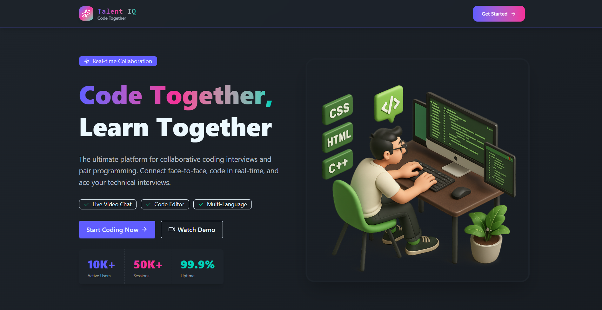
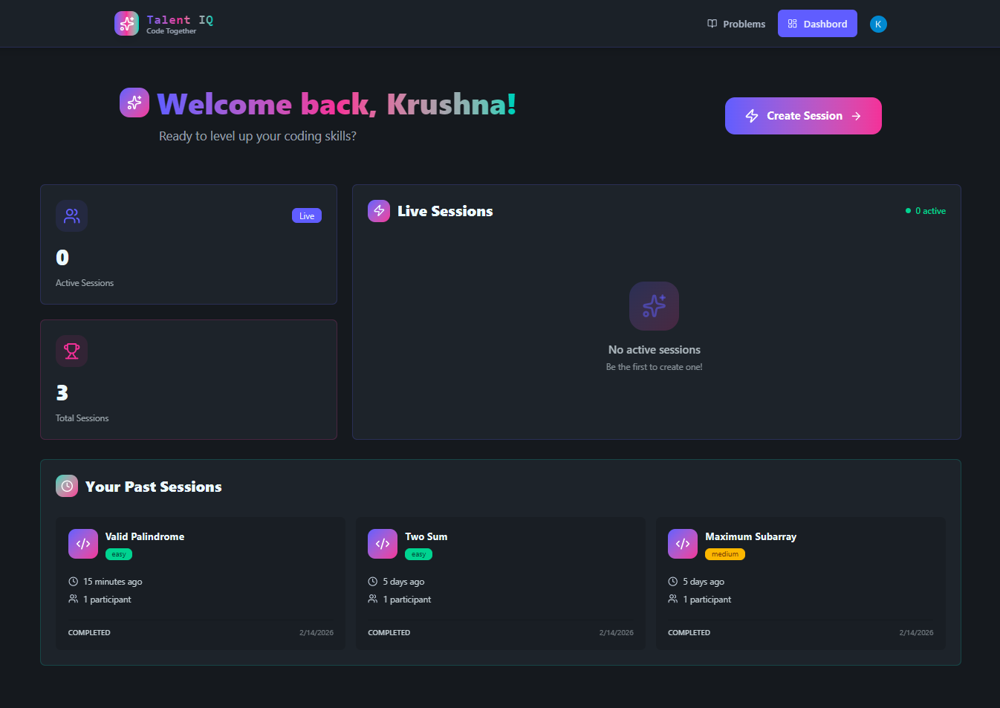
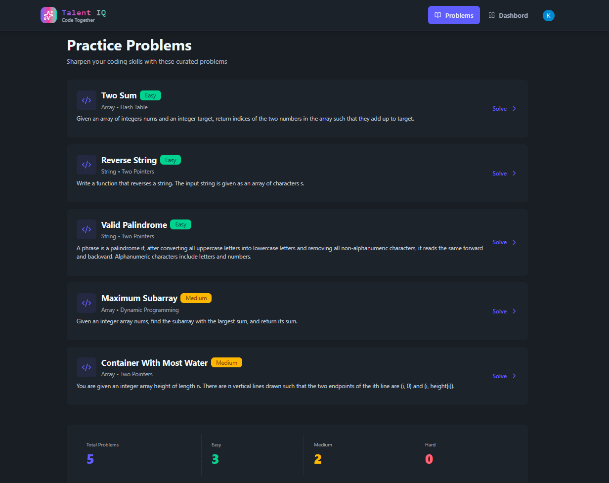
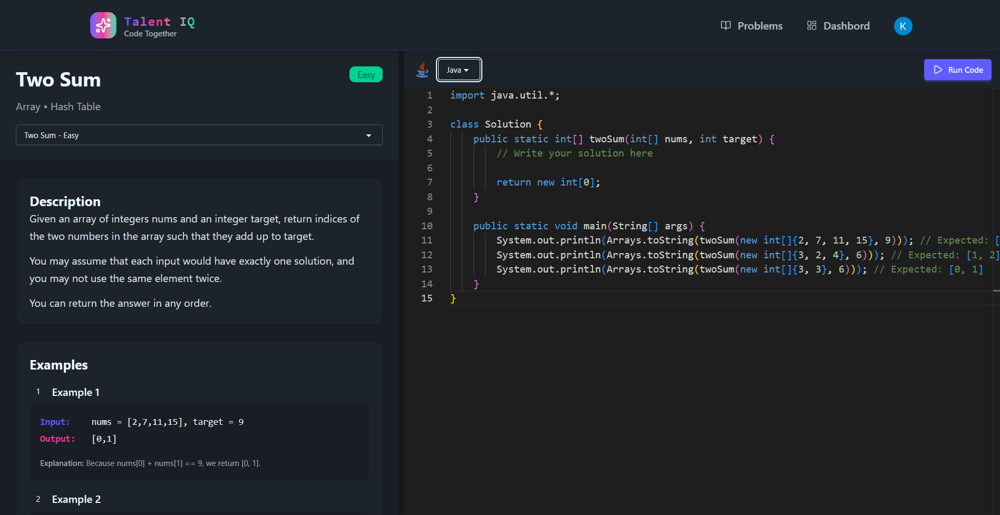
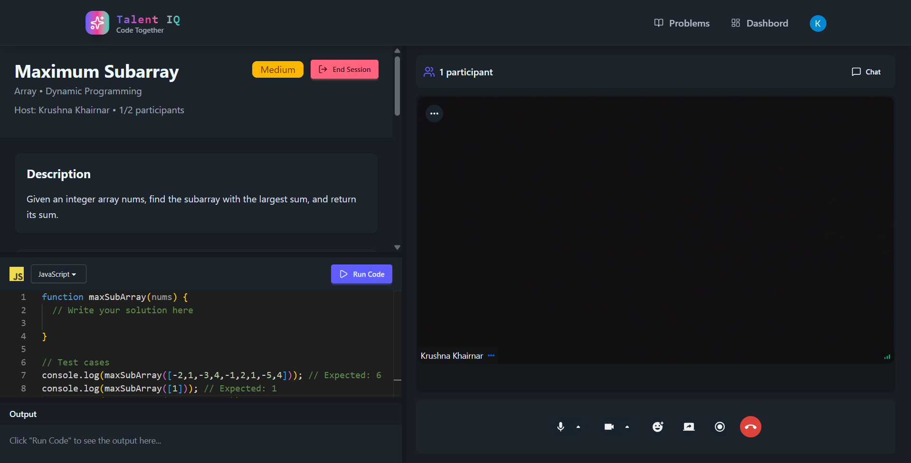

# 🧠 Talent IQ — Real-Time Coding Interview Platform

Talent IQ is a **full-stack, production-grade real-time coding interview platform** that enables developers to create and join live 1-on-1 coding sessions with integrated video calling and chat.

It combines **secure authentication**, **live collaborative environment**, **code execution**, and **session lifecycle management** into a scalable modern web application.

Built using **React (Vite)**, **Node.js**, **MongoDB**, **Clerk Authentication**, and **Stream Video & Chat SDK**, this project demonstrates real-world system design and production debugging experience.

---

## 🚀 Key Features

### 👤 Authentication & User Management
- Secure authentication using **Clerk**
- Auth middleware protection on backend routes
- Clerk-based identity

---

### 🎯 Coding Session Management
- Create 1-on-1 coding sessions
- Join active sessions
- Host & participant roles
- Automatic redirection when session ends
- Dashboard with:
  - Active sessions
  - Recent sessions

---

### 💻 Integrated Code Editor
- Multi-language support
- Starter code based on selected problem
- Code execution using **Piston API**
- Output panel for:
  - Standard output
  - Errors

---

### 🎥 Real-Time Video Calling
- Powered by **Stream Video SDK**
- Secure server-generated Stream tokens
- Host & participant auto-join logic
- Clean teardown on session end
- Lifecycle-safe initialization

---

### 💬 Live Chat During Session
- Powered by **Stream Chat SDK**
- Channel created per session
- Secure token authentication
- Real-time message updates

---

### 📊 Dashboard Experience
- View:
  - Active sessions
  - Past sessions
- Session count stats
- Prevent duplicate joins
- Role-based UI behavior

---

## 🧱 Tech Stack

### Frontend
- **React (Vite)**
- **React Router DOM**
- **TanStack Query**
- **Tailwind CSS + DaisyUI**
- **Axios**
- **Lucide Icons**

---

### Backend
- **Node.js**
- **Express.js**
- **MongoDB (Mongoose)**
- **Clerk Express Middleware**
- **Inngest (Event Handling)**

---

### Real-Time Services
- **Stream Video SDK**
- **Stream Chat SDK**
- **Piston API (Code Execution)**

---

## 📸 Screenshots


### Home / Explore Page


---

### Dashboard Page


---

### Problems Dashboard


---

### Indiviusal Problem Page


### Video Call Page


---

## ⚙️ Environment Variables

### Frontend `.env`

```env
VITE_CLERK_PUBLISHABLE_KEY=your_clerk_key
VITE_API_URL=your_backend_url
VITE_STREAM_API_KEY=your_stream_key
```

---

### Backend `.env`

```env
PORT=3000
DB_URL=your_mongodb_url

CLERK_SECRET_KEY=your_secret_key
CLIENT_URL=your_frontend_url

STREAM_API_KEY=your_stream_key
STREAM_API_SECRET=your_stream_secret
```

---

## 🧪 Getting Started

### 1️⃣ Clone the Repository

```bash
git clone https://github.com/krushna-khairnar/talent-IQ.git
cd talent-IQ
```

---

### 2️⃣ Install Backend

```bash
cd backend
npm install
npm run dev
```

---

### 3️⃣ Install Frontend

```bash
cd frontend
npm install
npm run dev
```

Open 👉 http://localhost:5173  